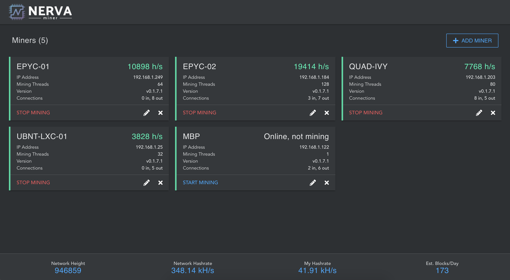

# nerva-dig
Web page for Nerva daemon miner control



#### Build with URL path

Set `VUE_PUBLIC_PATH=/<path>/` in `./env.withpath`

```bash
npm run build-with-path
```

#### Hosting
Some specific configuration may be needed depending on your web server.

For nginx
```nginx
location / {
    try_files $uri $uri/ /index.html;
}
```

See the [vue-router history mode docs](https://router.vuejs.org/guide/essentials/history-mode.html#example-server-configurations).


## Connecting to daemon
```bash
./nervad --rpc-bind-ip 0.0.0.0 --confirm-external-bind --rpc-access-control-origins <CORS addresses, your web server URL> --rpc-auth-basic --trusted-daemon --log-level 3
```
